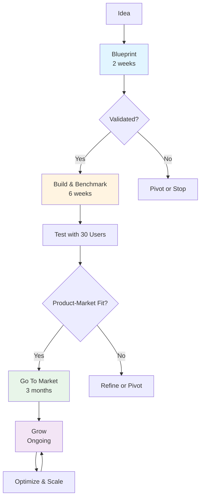
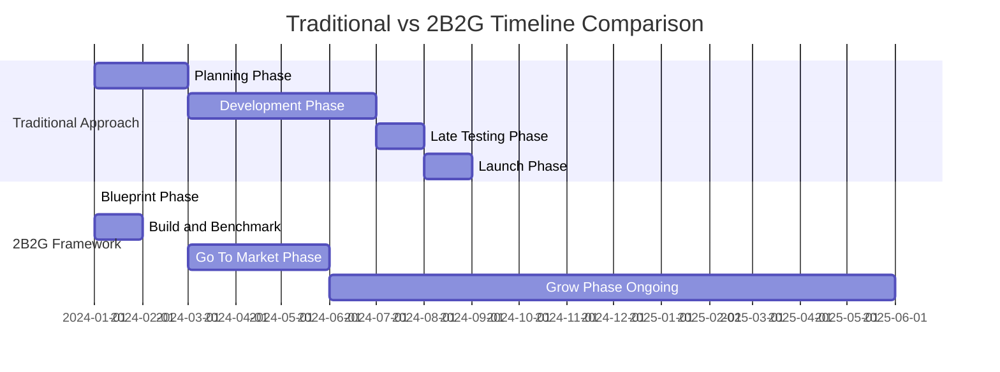

# The 2B2G Framework

## Overview

80% of digital products fail. Not because they're built wrong. Because they're built before validating.

We've built 50+ products for Indonesia's leading companies. Those projects took months. Sometimes years. We learned: Most time was wasted on wrong assumptions, unclear priorities, and building before validating.

So we develop 2B2G framework. Same quality. Different focus. We pick the most important things to validate. We set up platforms to capture feedback — how users interact, what they tell us. 8 weeks instead of 8 months.

**Promise:** From idea to validated product people actually use — within 8 weeks.

## The Problem We Solve

**Traditional Approach:**
- Build everything. Hope it works. Pivot when it doesn't.
- 6-12 months to launch. High failure rate. High Cost. Wasted resources.

**2B2G Approach:**
- Validate first. Build only what matters. Test with real users.
- 8 weeks to validated product. 80% success rate. Evidence-based decisions.

The difference? We plan before we build. We test before we scale. We measure before we assume.

## Process Flow

## Timeline Comparison

## The Four Phases

### 1. Blueprint (2 weeks)

**What it is:** Know exactly what to build before you build it.

**Problem solved:** Most teams start building without clear priorities. They waste months on features that don't matter.

**What you get:**
- Validated problem statement — Is this actually a problem worth solving?
- User personas — Who are you building for? What do they need?
- Feature prioritization — What to build first. What to skip.
- Technical architecture — How to build it. What stack to use.
- Market landscape — Who else is solving this? How are you different?
- 60-day roadmap — Clear plan from idea to launch.

**How it works:**
Week 1: We validate your problem. We talk to potential users. We research the market. We identify what matters.

Week 2: We create your blueprint. Clear priorities. Technical plan. Validation steps. Decision-ready.

**Deliverable:** A decision-ready plan. You know what to build. You know what to skip. You know how to validate.

**Go/No-Go Checkpoint:** At the end of Blueprint, you decide. Proceed to build? Pivot the idea? Stop and save resources?

### 2. Build & Benchmark (6 weeks)

**What it is:** Get a real product, tested with 30 real users.

**Problem solved:** Building without validation leads to expensive pivots. You build for months, then discover users don't want it.

**What you get:**
- Working MVP — Not a prototype. Not a demo. A product people actually use.
- Analytics setup — Track how users interact. What they click. Where they drop off.
- 30-user validation — Real users test your product. We collect feedback. We measure satisfaction.
- Performance benchmarks — Load time. Response time. User experience metrics.
- Pivot/proceed decision — Data tells you: refine, pivot, or scale.

**How it works:**
Weeks 1-4: We build your MVP. AI-assisted development speeds things up. Modern frameworks ensure quality. Every feature works. Loads fast. Fits user expectations.

Weeks 5-6: We test with 30 real users. We watch them use it. We ask questions. We collect feedback. We measure satisfaction.

**Deliverable:** A validated product. You have proof it works. You have data on what to improve. You know if users want it.

**Go/No-Go Checkpoint:** At the end of Build & Benchmark, you decide. Proceed to launch? Refine based on feedback? Pivot to a different approach?

### 3. Go To Market (3 months)

**What it is:** Launch with evidence, not hope.

**Problem solved:** Great products fail because nobody knows about them. Or they launch to the wrong audience. Or the messaging doesn't resonate.

**What you get:**
- Launch strategy — Who to target. How to reach them. When to launch.
- Positioning — How you're different. Why it matters.
- Messaging — What to say. How to say it.
- Launch campaigns — Paid ads. Content. Email. Social. Whatever works.
- Onboarding flow — How new users get started. What they see first.
- Performance tracking — Who's coming. Who's converting. What's working.

**How it works:**
Month 1: We position your product. We craft your message. We set up tracking. We plan your launch.

Month 2: We launch. We run campaigns. We activate users. We measure everything.

Month 3: We optimize. We double down on what works. We cut what doesn't. We grow early traction.

**Deliverable:** A launched product with real users. You know who's coming. You know what's working. You have early traction.

**Success metrics:** User signups. Activation rate. Retention. Engagement. Revenue (if applicable).

### 4. Grow (Ongoing)

**What it is:** Turn early traction into sustainable growth.

**Problem solved:** Products stall after launch. Teams stop improving. Users fade. Growth slows.

**What you get:**
- Product optimization — Analyze user behavior. Fix what's broken. Improve what works.
- Feature rollout — Add features users actually want. Based on data, not assumptions.
- Marketing campaigns — AI-supported campaigns that learn and adapt. Expert-led strategy.
- Growth analytics — Track acquisition. Track retention. Track revenue. Know what's working.
- Scaling roadmap — What to build next. How to grow. When to scale.

**How it works:**
We analyze. We optimize. We experiment. We measure. We iterate.

Every month: Review data. Identify opportunities. Test improvements. Measure results. Scale what works.

**Deliverable:** Sustainable growth. Your product keeps improving. Your campaigns keep learning. Your users keep coming back.

## How It Works Together

Each phase builds on the last. Blueprint informs Build. Build informs Go To Market. Go To Market informs Grow.

**Feedback loops:** User feedback from Build flows into Go To Market. Launch data from Go To Market flows into Grow. Growth insights inform future features.

**Decision points:** At the end of each phase, you decide. Proceed? Pivot? Stop? Data guides every decision.

**Speed:** We move fast. But we validate at every step. No wasted time. No wrong assumptions.

## Engagement Models

### Blueprint Only (2 weeks)

**For:** Founders who need clarity before building.

**What you get:** Decision-ready plan. Clear priorities. Validation steps. Technical architecture.

**Investment:** IDR 50-150M

**Best for:** Dreamers testing ideas. Companies validating concepts before full commitment.

### Full 2B2G Cycle (8 weeks)

**For:** Serious founders ready to launch.

**What you get:** Blueprint + Build & Benchmark. From idea to validated product in 8 weeks.

**Investment:** IDR 150-500M

**Best for:** Growing Businesses. Corporate innovation units. Founders ready to execute.

### Grow Retainer (Ongoing)

**For:** Products that need to scale.

**What you get:** Product optimization. Marketing campaigns. Growth analytics. Scaling roadmap.

**Investment:** IDR 20M/month (minimum 40M for 2 months)

**Best for:** Products with early traction. Companies ready to scale. Teams that need ongoing support.

## Common Questions

**Q: Can I skip phases?**

A: No. Each phase builds on the last. Blueprint ensures you build the right thing. Build validates it works. Go To Market gets it to users. Grow scales it.

**Q: What if my idea changes during Blueprint?**

A: That's the point. Blueprint validates your idea. If it needs to change, change it. Better to pivot in 2 weeks than 6 months.

**Q: What if users don't like the MVP?**

A: That's valuable data. You know what to fix. You know what to change. Better to learn in 6 weeks than 6 months.

**Q: Do I own the code?**

A: Yes. You own everything. Code. Design. Documentation. All of it.

**Q: What happens after 8 weeks?**

A: You have a validated product. You can launch it yourself. Or engage us for Go To Market and Grow phases.

**Q: Can you work with my existing team?**

A: Yes. We integrate with your team. We provide structure. You provide domain knowledge. Together, we move fast.

**Q: What if I need changes mid-project?**

A: We build flexibility into the process. Changes are expected. We adjust. We communicate. We stay on track.

## Visual Elements

### Image Suggestions

1. **Process Flow Diagram** — Visual representation of the 2B2G flow with icons for each phase
2. **Timeline Infographic** — Side-by-side comparison: Traditional (8 months) vs 2B2G (8 weeks)
3. **Deliverables Showcase** — Visual cards showing what clients receive at each phase
4. **Success Metrics Dashboard** — Mock dashboard showing 80% success rate, 50+ products, etc.
5. **Team Collaboration Photo** — Real photo of team working together (if available)
6. **Client Testimonial Visual** — Quote cards with client photos/logos

### Animation Suggestions

1. **Phase Progression Animation**
   - Animated flow showing progression: Idea → Blueprint → Build → GTM → Grow
   - Each phase lights up/expands as user scrolls
   - Visual transitions between phases

2. **Timeline Scrubber**
   - Interactive timeline: users scrub through 8 weeks
   - See what happens each week
   - Milestones appear as you scrub

3. **Deliverables Reveal**
   - Animated cards/boxes reveal deliverables as user scrolls
   - Each phase section triggers reveal animation
   - Smooth fade-in or slide-up effects

4. **Validation Loop Animation**
   - Animated loop showing feedback flow
   - User feedback → Analysis → Optimization → Back to users
   - Continuous loop visualization

5. **Comparison Animation**
   - Side-by-side: old process (slow, linear) vs new process (fast, iterative)
   - Animated bars showing time difference
   - Success rate comparison with animated numbers

6. **Success Metrics Counter**
   - Animated numbers counting up: 80% success rate, 50+ products
   - Trigger on scroll into view
   - Smooth counting animation

7. **User Journey Animation**
   - Animated path: user moves from "idea" to "traction"
   - Progress bar showing movement through framework
   - Checkpoints light up as user progresses

**Animation Implementation Notes:**
- Use CSS animations for simple transitions
- SVG animations for diagrams
- Scroll-triggered animations (AOS library or similar)
- Consider GSAP for complex animations
- Ensure animations don't slow down page load
- Make animations optional/disable-able for accessibility
